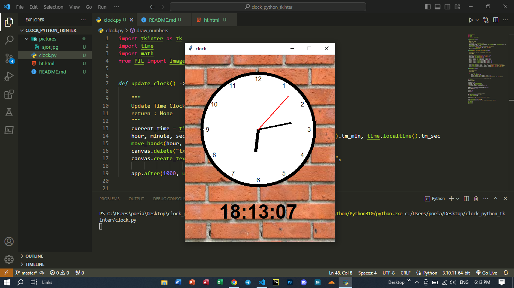

# HELLO WELCOME 
## Creating a wall clock application using the tkinter library
# FOR RUN FILE:
#       INSTALL PAKAGES:
###                1.pillow
###                2.tkinter
# SHOW PICTURE APP PAGE ...
